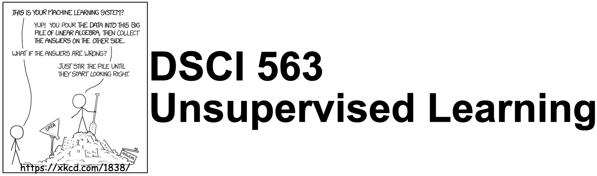

## Important links 

- [Course Jupyter book](https://pages.github.ubc.ca/mds-2021-22/DSCI_563_unsup-learn_students/README.html)
- [Course GitHub page](https://github.ubc.ca/MDS-2021-22/DSCI_563_unsup-learn_students)
- [Slack Channel](https://ubc-mds.slack.com/messages/563_unsup-learn)
- [Canvas](https://canvas.ubc.ca/courses/83554)
- [Gradescope](https://www.gradescope.ca/courses/6270)
- [YouTube videos](https://www.youtube.com/playlist?list=PLHofvQE1VlGtZoAULxcHb7lOsMved0CuM)
- [Class + office hours calendar](https://ubc-mds.github.io/calendar/)

## License

© 2021 Varada Kolhatkar, Rodolfo Lourenzutti, and Mike Gelbart

Software licensed under [the MIT License](https://spdx.org/licenses/MIT.html), non-software content licensed under [Attribution 4.0 International (CC BY 4.0) License](https://creativecommons.org/licenses/by/4.0/). See the [license file](LICENSE.md) for more information.

## Course learning outcomes    
This course is about identifying underlying structure in data. We will talk about clustering, dimensionality reduction, word embeddings, and recommendation systems. 

<details>
  <summary>Click to expand!</summary>  
    
By the end of the course, students are expected to be able to
    
- Explain the unsupervised paradigm. 
- Explain the intuition behind clustering and use appropriate clustering algorithms for applications such as customer segmentation and document clustering. 
- Interpret the results obtained after applying clustering. 
- Explain the intuition behind dimensionality reduction. 
- Broadly explain and use linear dimensionality reduction techniques such as PCA, LSA, and NMF. 
- Explain the intuition of word2vec model to create word embeddings. 
- Train your own word embeddings and use pre-trained word embeddings.
- Explain and build recommender systems, specifically using collaborative filtering approaches. 
</details>


## Deliverables

<details>
  <summary>Click to expand!</summary>
    
The following deliverables will determine your course grade:

| Assessment       | Weight  | Where to submit|
| :---:            | :---:   |:---:  | 
| Lab Assignment 1 | 15%     | [Gradescope](https://www.gradescope.ca/courses/6270) |
| Lab Assignment 2 | 15%     | [Gradescope](https://www.gradescope.ca/courses/6270) |
| Lab Assignment 3 | 15%     | [Gradescope](https://www.gradescope.ca/courses/6270) |
| Lab Assignment 4 | 15%     | [Gradescope](https://www.gradescope.ca/courses/6270) |
| Quiz 1           | 20%     | [Canvas](https://canvas.ubc.ca/courses/83554)     |
| Quiz 2           | 20%     | [Canvas](https://canvas.ubc.ca/courses/83554)     |

See [Calendar](https://ubc-mds.github.io/calendar/) for the due dates. 
</details>

## Teaching team
<details>
  <summary>Click to expand!</summary>

    
| Role | Name  | Slack Handle |
| :------: | :---: | :----------: |
| Lecture instructor | Varada Kolhatkar | `@varada` |
| Lab instructor | Varada Kolhatkar | `@varada` |
| Teaching assistant | Daniel Ramandi |   | 
| Teaching assistant | David Wakeham |   |
| Teaching assistant | Dollina Dodani |   |    
| Teaching assistant | Matthew Nguyen |   |
| Teaching assistant | Mobina Mahdavi |   |
| Teaching assistant | Ngoc Bui  |   |
    
</details>  

## Class meetings
This course will be run in person. We will meet three times every week: twice for lectures and once for the lab. You can refer to the [Calendar](https://ubc-mds.github.io/calendar/) for lecture and lab times and locations. Lectures of this course will be a combination of a few pre-recorded videos, traditional live lecturing, and class activities. The night before each lecture, the material will be made available to you.  

### Lecture Schedule

This course occurs during **Block 5** in the 2021/22 school year. 

| Lecture  | Topic  | Assigned videos  | Resources and optional readings |
|-------|------------|-----------|-----------|
| 0     | [Course Information](lectures/00_course-information.ipynb) | | |
| 1     | [K-Means Clustering](lectures/01_lecture-k-means.ipynb)  | 📹  <li> Videos: [14.1](https://youtu.be/caAuUAXwpb8), [14.2](https://youtu.be/s6AvSZ1_l7I),[14.3](https://youtu.be/M5ilrhcL0oY)| <li>[`sklearn` clustering documentation](https://scikit-learn.org/stable/modules/clustering.html)</li><li>["Spaghetti Sauce" talk by Malcom Gladwell](https://www.ted.com/talks/malcolm_gladwell_on_spaghetti_sauce?language=en)</li><li>[Visualizing-k-means-clustering](https://www.naftaliharris.com/blog/visualizing-k-means-clustering/)</li><li>[Visualizing K-Means algorithm with D3.js](http://tech.nitoyon.com/en/blog/2013/11/07/k-means/)</li><li>[Clustering with Scikit with GIFs](https://dashee87.github.io/data%20science/general/Clustering-with-Scikit-with-GIFs/)</li>|
| 2    | [DBSCAN and Hierarchical Clustering](lectures/02_DBSCAN-hierarchical.ipynb)  | 📹  <li> Videos: [15.1](https://youtu.be/1ZwITQyWpkY), [15.2](https://youtu.be/T4NLsrUaRtg), [15.3](https://youtu.be/NM8lFKFZ2IU) | <li>Comparison of [sklearn clustering algorithms](https://scikit-learn.org/stable/modules/clustering.html#overview-of-clustering-methods)</li><li>[DBSCAN Visualization](https://www.naftaliharris.com/blog/visualizing-dbscan-clustering/)</li><li>[Clustering with Scikit with GIFs](https://dashee87.github.io/data%20science/general/Clustering-with-Scikit-with-GIFs/)</li> | 
| 3    | [Dimensionality Reduction Intro](lectures/03_PCA-intro.ipynb) | 📹  <li> Videos: [17.1](https://youtu.be/r-DwXpg1YDI), [17.2](https://youtu.be/33TRSSuzALw), [17.3](https://youtu.be/g5w3o1TE6hU)</li> | <li>[PCA visualization](https://setosa.io/ev/principal-component-analysis/)</li><li>[Introduction to Machine Learning with Python book Chapter 3](https://learning.oreilly.com/library/view/introduction-to-machine/9781449369880/ch03.html)</li><li>[Mike's PCA video from CPSC 340](https://www.youtube.com/watch?v=7cBkOC_UD4o&list=PLWmXHcz_53Q02ZLeAxigki1JZFfCO6M-b&index=25&t=0s)</li><li>[StatQuest PCA video](https://www.youtube.com/watch?v=FgakZw6K1QQ&feature=youtu.be)</li> |
| 4    | [More PCA, LSA, NMF, Autoencoders](lectures/04_LSA-NMF-AE.ipynb) | No videos | 
|   5   | [Word Vectors, Word Embeddings](lectures/05_word-embeddings.ipynb) | 📹  <li> Videos: [18.1](https://youtu.be/7nGGogNUrtg), [18.2](https://youtu.be/aj8OWol-H2I), [18.3](https://youtu.be/rWoA-IKGDa8)</li> | Word2Vec papers: <li>[Distributed representations of words and phrases and their compositionality](https://papers.nips.cc/paper/5021-distributed-representations-of-words-and-phrases-and-their-compositionality.pdf)</li> <li>[Efficient estimation of word representations in vector space](https://arxiv.org/pdf/1301.3781.pdf)</li> <li>[word2vec Explained](https://arxiv.org/pdf/1402.3722.pdf)</li><li>[Debiasing Word Embeddings](http://papers.nips.cc/paper/6228-man-is-to-computer-programmer-as-woman-is-to-homemaker-debiasing-word-embeddings.pdf)</li>|
|   6   | [Using Word Embeddings, Manifold Learning](lectures/06_more-word2vec-tsne.ipynb) | No videos | <li>[t-SNE tutorial](https://github.com/oreillymedia/t-SNE-tutorial)</li><li>[How to use t-SNE effectively](https://distill.pub/2016/misread-tsne/)</li><li>[LargeVis](https://github.com/elbamos/largeVis)</li><li>[UMAP](https://github.com/lmcinnes/umap)</li> |
| 7    | [Recommender Systems I](lectures/07_recommender-systems1.ipynb) | No videos | <li>[Collaborative filtering for recommendation systems in Python, by N. Hug](https://www.youtube.com/watch?v=z0dx-YckFko)</li><li>[How Netflix’s Recommendations System Works](https://help.netflix.com/en/node/100639)</li>|
| 8    | [Recommender Systems II](lectures/08_recommender-systems2.ipynb) | No videos | <li>[SVDfeature](https://www.jmlr.org/papers/v13/chen12a.html)</li>|


### Datasets
Here is the list of [Kaggle](https://www.kaggle.com/) datasets we'll use in this class. 
- [Credit Card Dataset for Clustering](https://www.kaggle.com/arjunbhasin2013/ccdata)
- [Countries of the World](https://www.kaggle.com/fernandol/countries-of-the-world)
- [Airline Sentiment](https://www.kaggle.com/jaskarancr/airline-sentiment-dataset)
- [Jester 1.7M jokes ratings dataset](https://www.kaggle.com/vikashrajluhaniwal/jester-17m-jokes-ratings-dataset)
- [Amazon ratings data](http://snap.stanford.edu/data/amazon/productGraph/categoryFiles/ratings_Patio_Lawn_and_Garden.csv)

If you want to be extra prepared, you may want to download these datasets in advance and save them under the `lectures/data` directory in your local copy of the repository. 

## Labs 

The labs are going to be in person. We will also be holding a short 1-hour parallel Zoom session for each lab run by the TAs so that people who cannot join in person have an opportunity to ask questions and get help. You will be able to access appropriate Zoom links via [Canvas](https://canvas.ubc.ca/courses/78168/external_tools/15408). 

There will be a lot of opportunity for discussion and getting help during lab sessions. (Usually I enjoy labs a lot. It's also an opportunity for me to know you a bit better 🙂.) 


## Installation
 
We are providing you with a `conda` environment file which is available [here](env-dsci-563.yml). You can download this file and create a conda environment for the course and activate it as follows. 

```
conda env create -f env-dsci-563.yml
conda activate 563
```
In order to use this environment in `Jupyter`, you will have to install `nb_conda_kernels` in the environment where you have installed `Jupyter` (typically the `base` environment). You will then be able to select this new environment in `Jupyter`. For more details on this, refer to "Making environments work well with JupyterLab section" in your [521 lecture 8](https://github.ubc.ca/mds-2021-22/DSCI_521_platforms-dsci_students/blob/master/materials/materials/lectures/8-asking-effectively-and-virtual-environments.ipynb).

I've only tried installing this environment file on a couple of machines, and it's possible that you will encounter problems with some of the packages from the `yml` file when you run the commands above. This is not unusual. It often means that the package with the given version is not available for your operating system via `conda` yet. There are a couple of options for you when this happens:
1. Get rid of the line with that package from the `yml` file.
2. Create the environment without that package. 
3. Activate the environment and install the package manually either with `conda install` or `pip install` in the environment.   

_Note that this is not a complete list of the packages we'll be using in the course and there might be a few packages you will be installing using `conda install` later in the course. But this is a good enough list to get you started._ 

## Course communication
<details>
    <summary>Click to expand!</summary>    
    
We all are here to help you learn and succeed in the course and the program. Here is how we'll be communicating with each other during the course. 

### Clarifications on the lecture notes or lab questions

If there is any clarification on the lecture material or lab questions, I'll open an issue in the [course repository](https://github.ubc.ca/MDS-2021-22/DSCI_563_unsup-learn_students) and tag you. **It is your responsibility to read the messages whenever you are tagged.** (I know that there are too many things for you to keep track of. You do not have to read all the messages but please make sure to carefully read the messages whenever you are tagged.) 

### Questions on lecture material or labs

If you have questions about the lecture material or lab questions please post them on the course Slack channel rather than direct messaging me or the TAs. Here are the advantages of doing so: 
- You'll get a quicker response. 
- Your classmates will benefit from the discussion. 

I encourage you to use some consistent convention when you ask questions on Slack to facilitate easy search for others or future you. For example, if you want to ask a question on Exercise 3.2 from Lab 1, start your post with the label `lab1-ex2.3`. Or if you have a question on lecture 2 material, start your post with the label `lecture2`. Once the question is answered/solved, you can add "(solved)" tag before the label (e.g., (solved) `lab1-ex2.3`. Do not delete your post even if you figure out the answer on your own. The question and the discussion can still be beneficial to others. 

### Questions related to grading

For each deliverable, after I return grades, I'll let you know who has graded what by opening an issue in the course GitHub repository. If you have questions related to grading, please send a direct message to the appropriate TA on Slack and tag them. If you are unable to resolve the issue with the TA, include me in the conversation. 

### Questions related to your personal situation or talking about sensitive information
 
I am open for a conversation with you. If you want to talk about anything sensitive, please direct message me on Slack (and tag me) rather than posting it on the course channel. It might take a while for me to get back to you, but I'll try my best to respond as soon as possible. 
</details>
    
## Working during the COVID-19 global pandemic
    
<details>
    <summary>Click to expand!</summary>
    
We are working together on this course during a global pandemic. Everyone is struggling to some extent. If you tell me you are having trouble, I am not going to judge you or think less of you. I hope you will extend me the same grace!

Here are some ground rules:

- If you are unable to submit a deliverable on time, please reach out **before** the deliverable is due.
- If you need extra support, the teaching team is here to work with you. Our goal is to help each of you succeed in the course.
- If you are struggling with the material, the new hybrid teaching format, or anything else, please reach out. I will try to find time and listen to you empathetically.
- If I am unable to help you, I might know someone who can. UBC has some [great student support resources](https://students.ubc.ca/support).
   

### Covid Safety at UBC

**Masks:** This class is going to be in person. Masks are required indoors, including in classrooms, as per the [BC Public Health Officer orders](https://www2.gov.bc.ca/gov/content/covid-19/info/restrictions#masks). For the purposes of this order, the term "masks" refers to medical and non-medical masks that cover our noses and mouths.  Masks are a primary tool to make it harder for Covid-19 to find a new host.  You will need to wear a medical or non-medical mask anytime you are indoors at UBC, for your own protection, and the safety and comfort of everyone else in the class. Please do not eat in the classroom. If you need to drink water/coffee/tea/etc, please keep your mask on between sips. Please note that there are some people who cannot wear a mask. These individuals are equally welcome in our class. 

**Vaccination:** If you have not yet had a chance to get vaccinated against Covid-19, vaccines are available to you, free, and on campus [http://www.vch.ca/covid-19/covid-19-vaccine]. The higher the rate of vaccination in our community overall, the lower the chance of spreading this virus.  You are an important part of the UBC community. Please arrange to get vaccinated if you have not already done so. 

**COVID-19 testing:** UBC will require COVID-19 testing for all students, faculty and staff, with exemptions provided for those who are vaccinated against COVID-19: [https://news.ubc.ca/2021/08/26/ubc-implements-vaccine-declaration-and-rapid-testing-for-covid-19/]

**Your personal health:**
If you're sick, it's important that you stay home – no matter what you think you may be sick with (e.g., cold, flu, other). A daily self-health assessment is required before attending campus. Every day, before leaving home, complete the self-assessment for Covid symptoms using [this tool](https://bc.thrive.health/covid19/en ).

Stay home if you have Covid symptoms, have recently tested positive for Covid, or are required to quarantine. You can check [this website](http://www.bccdc.ca/health-info/diseases-conditions/covid-19/self-isolation#Who) to find out if you should self-isolate or self-monitor. 

Your precautions will help reduce risk and keep everyone safer. In this class, the marking scheme is intended to provide flexibility so that you can prioritize your health and still be able to succeed: 
- All course notes will be provided online. 
- All homework assignments can be done and handed in online. 
- All exams will be held online.  
- Most of the class activity will be video recorded and will be made available to you. 
- Before each class, I'll also try to post some [videos on YouTube](https://www.youtube.com/watch?v=-1hTcS5ZE4w&list=PLHofvQE1VlGtZoAULxcHb7lOsMved0CuM) to facilitate hybrid learning. 
- There will be at least a few office hours which will be held online. 
</details> 

## Reference Material
<details>
    <summary>Click to expand!</summary>   

### Books
* [A Course in Machine Learning (CIML)](http://ciml.info/) by Hal Daumé III (also relevant for DSCI 572, 573, 575, 563)
* Introduction to Machine Learning with Python: A Guide for Data Scientists by Andreas C. Mueller and Sarah Guido.
* [The Elements of Statistical Learning (ESL)](https://web.stanford.edu/~hastie/Papers/ESLII.pdf)
* [ML:APP](http://www.cs.ubc.ca/~murphyk/MLbook/index.html), 
* [LFD](http://amlbook.com/), 
* [AI:AMA](http://aima.cs.berkeley.edu/)
* [An Introduction to Statistical Learning](http://www-bcf.usc.edu/~gareth/ISL/ISLR%20Sixth%20Printing.pdf)

### Linear algebra review

- There are a bunch of suggestions [here](https://ubc-mds.github.io/resources_pages/learning_resources/). We particularly recommend [essence of linear algebra](https://www.youtube.com/watch?v=kjBOesZCoqc&list=PLZHQObOWTQDPD3MizzM2xVFitgF8hE_ab) (YouTube series) and
[Immersive linear algebra](http://immersivemath.com/ila/index.html) (interactive e-book).
- [Introduction to Linear Algebra for Applied Machine Learning with Python](https://pabloinsente.github.io/intro-linear-algebra)

### Online courses

* [Mike's CPSC 340](https://ubc-cs.github.io/cpsc340/)
* [Machine Learning](https://www.coursera.org/learn/machine-learning) (Andrew Ng's famous Coursera course)
* [Foundations of Machine Learning](https://bloomberg.github.io/foml/#home) online course from Bloomberg.
* [Machine Learning Exercises In Python, Part 1](http://www.johnwittenauer.net/machine-learning-exercises-in-python-part-1/) (translation of Andrew Ng's course to Python, also relevant for DSCI 561, 572, 563)

</details> 
  
## Policies

Please see the general [MDS policies](https://ubc-mds.github.io/policies/).
